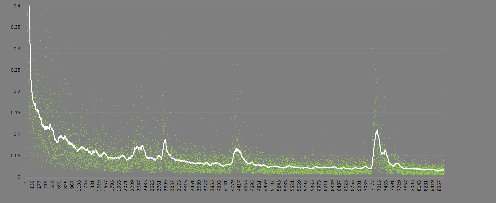
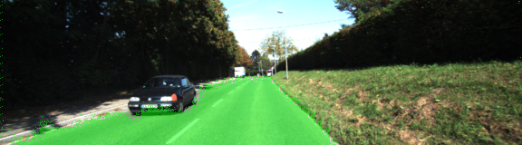
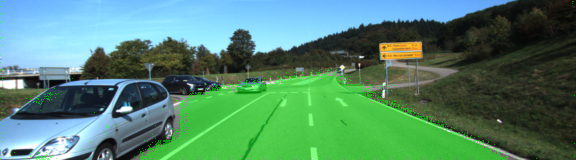
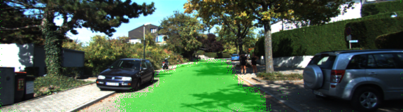
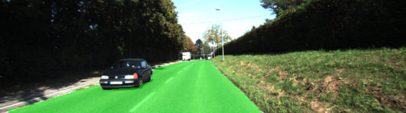
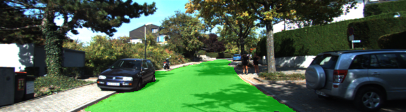

### Semantic Segmentation
---


In this project, a fully convolutional network (FCN) is trained to identify roads in a set of images from the Kitti benchmark. Road pixels are labeled with a green color. The program is written in Python 3.5.2 and Tensorflow 1.1.0.

#### Load

The pretrained VGG model is loaded by the function `load_vgg` defined at
[line 26](./main.py#L26).

#### Features

The function `layers` at [line 50](./main.py#L50) defines the FCN connections.

#### Optimization

The function `optimize` at [line 89](./main.py#L89) reshapes the output and defines the loss function and optimizer.

#### Training

The function `train_nn` at [line 110](./main.py#L110) trains the neural network and prints the loss value of the network during the process.
<pre>
TensorFlow Version: 1.1.0
Default GPU Device: /gpu:0
Tests Passed
Tests Passed
Tests Passed
Tests Passed
Tests Passed
Epoch  0  Batch  0  Loss  1.44872
Epoch  0  Batch  1  Loss  0.983396
Epoch  0  Batch  2  Loss  1.07927
Epoch  0  Batch  3  Loss  0.879091
...
Epoch  4  Batch  83  Loss  0.041279
...
Epoch  17  Batch  44  Loss  0.03693
...
Epoch  29  Batch  276  Loss  0.0105523
...
</pre>

#### Loss

On average, the model decreases loss over time. In the graph below, the loss value for each training cycle is shown as a data point in light green. The white line indicates a running average over a period of 80 cycles.



#### Hyperparameters

Several values of epoch, batch size, learning rate, and drop out rate were attempted. The final run includes regularization.

Trials log:
<pre>
20170901.2045
Epochs 6 Batch size 2 (4,4,16 on the layers)
1504323710.6330247
too fuzzy
(sample images in the results section below)

20170901.2107
Epochs 12 Batch size 2
1504325008.0188742
Edges are cleaner, but not sharp
(additional sample images for each trial can be found in the `images` directory of this repository)

20170902.0026
Epochs 16 Batch size 8
1504336949.7439263
Edges are more fuzzy

20170902.1615
Epochs 15 Batch size 8 (5,5,14 on the layers)
1504393892.7951236
Edges fuzzy still

20170902.1642
keep_prob : 0.75, learning_rate : 1e-4
1504395542.9182162
Better, sharper

20170902.1720
Epochs 16 Batch size 4 (4,4,16 on the layers)
keep_prob : 0.80, learning_rate : 1.1e-4
1504397809.8027592
Sharp, but some images go out of bounds.

20170902.1940-2021
Epochs 30 Batch size 1, learning_rate : 1e-4
1504408684.2301085
Sharp, but a few are flooded too far and a few under-segmented

20170902.2137-2229
Add l2 regularizer + keep_prob : 0.65
1504416380.7735312
Much better, only a few are flooded.
(sample images in the results section below)
</pre>

#### Results

Training cycles and inference were performed on a NVIDIA GTX 1070 GPU hosted by Windows 7 on a Xeon W3520 (equivalent to i7 920 generation 1) running at 2.8GHz with 12GB memory and 500GB SSD (SATA6) storage. The final run took 50 minutes.

Initially, the pixels were dithering at the edges of the road. Further adjustments to the hyperparameters yielded sharper edges, but in a few cases extended onto sidewalks. Additional epochs and inclusion of regularization produces a satisfactory run where the project labels most pixels of roads close to the best solution and predicts correctly most of the images.

Examples of improvement from the first run to the final are shown below. An image is sampled from each of the three training categories: marked, marked multiple lane, and unmarked roads.

First run...Epochs:6, Batch size:2, Dropout: 50%, Regularization: None





---
Last run...Epochs:30, Batch size:1, Dropout: 35%, Regularization: L2 1e-3





#### References
https://people.eecs.berkeley.edu/~jonlong/long_shelhamer_fcn.pdf

http://www.cvlibs.net/datasets/kitti/eval_road.php
<pre>@INPROCEEDINGS{Fritsch2013ITSC,
  author = {Jannik Fritsch and Tobias Kuehnl and Andreas Geiger},
  title = {A New Performance Measure and Evaluation Benchmark for Road Detection Algorithms},
  booktitle = {International Conference on Intelligent Transportation Systems (ITSC)},
  year = {2013}
}
</pre>
---
### Setup
##### Frameworks and Packages
Make sure you have the following is installed:
 - [Python 3](https://www.python.org/)
 - [TensorFlow](https://www.tensorflow.org/)
 - [NumPy](http://www.numpy.org/)
 - [SciPy](https://www.scipy.org/)
##### Dataset
Download the [Kitti Road dataset](http://www.cvlibs.net/datasets/kitti/eval_road.php) from [here](http://www.cvlibs.net/download.php?file=data_road.zip).  Extract the dataset in the `data` folder.  This will create the folder `data_road` with all the training a test images.

##### Run
Run the following command to run the project:
```
python main.py
```
**Note** If running this in Jupyter Notebook system messages, such as those regarding test status, may appear in the terminal rather than the notebook.
